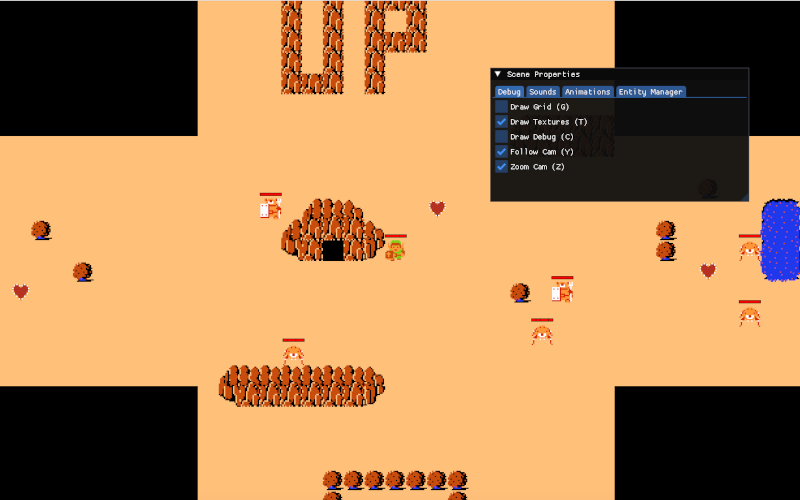

# comp4300-a4
Zelda (Assignment 04 for COMP 4300 Course)

--------------------------------------
<div align="center">

[]()
[](https://en.cppreference.com/w/cpp/compiler_support/20)


</div>

## About the course
[Video Lectures on YouTube](https://www.youtube.com/playlist?list=PL_xRyXins848nDj2v-TJYahzvs-XW9sVV)
COMP 4300 - C++ Game Programming (2022-09) by Dave Churchill

## About the assignment

The code differs a little bit from the one that is shown on YouTube. But that's fine because I'm not
a student of a Dave Churchill thus I've no access to the initial code given to students.

I should thank [yoctonit](https://github.com/yoctonit/comp4300/tree/master/assignment4) 😊
for providing the initial code for Assignment 04 otherwise I wouldn't have anything to start with.

For more information about assignment itself, please read the
[ASSIGNMENT.md](ASSIGNMENT04.md) file.

Zoomed in

Zoomed out


## Dev Notes
I'm using CLion as my IDE, and I try to follow a guideline from
[CLion:](https://www.jetbrains.com/help/clion/clangformat-as-alternative-formatter.html)
along with the style the lecturer provided in his examples.

If you like to take deeper into what and where, I recommend using this source
[lefticus](https://lefticus.gitbooks.io/cpp-best-practices/content/03-Style.html)

Nonetheless, I consult authoritative pillars such as the
([C++ Core Guidelines](https://isocpp.github.io/CppCoreGuidelines/CppCoreGuidelines.html))
and [Google C++ Style Guide](https://google.github.io/styleguide/cppguide.html)
to ensure that the code remains readable and consistent.

### Guide style
* Each row of text in your code should be at most 120 characters long;
* Use a .cpp suffix for code files and .hpp for interface files;
* [Names and order of includes](https://google.github.io/styleguide/cppguide.html#Names_and_Order_of_Includes)
  Related header, C system headers, C++ standard library headers, other headers;
* In a class I prefer to see public methods, private methods, public vars, private vars. Exactly
  in this order.

### Build & run

run the script
```bash
chmod +x PlayGame.sh && ./PlayGame.sh
```
